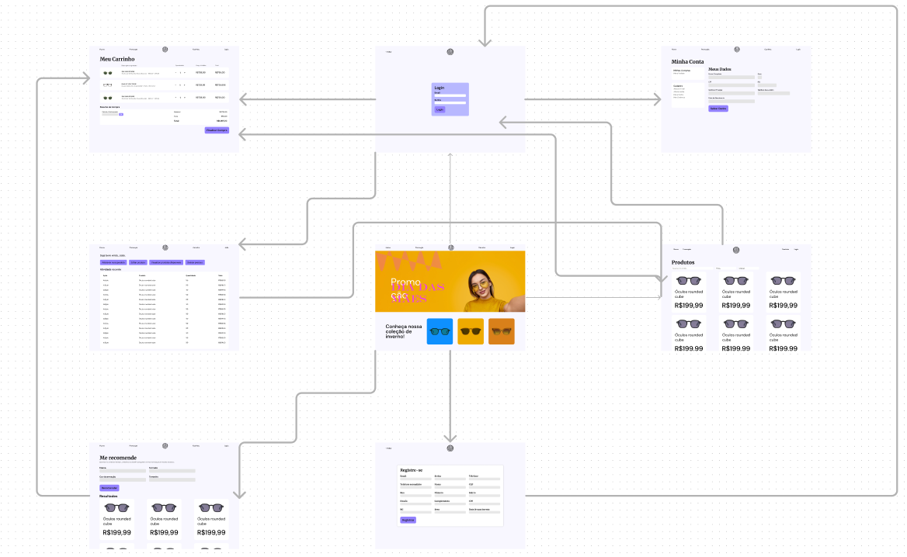
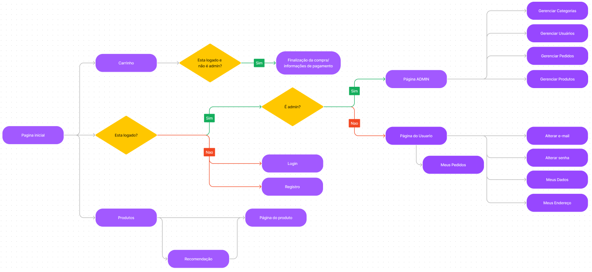

# Ocularis
## Autores
#### Grupo 7
* Israel Felipe da Silva nUSP: 11796531
* Gabriel Fernando Machado Fachini - 11953481
* 

## Requisitos
Ocularis é uma ótica online que vende óculos e produtos relacionados. A plataforma tem todas funcionalidades para o cliente ver, selecionar e comprar os produtos. A plataforma também oferece uma funcionalidade extra integrada com o chatGPT para que o cliente selecione algumas especificações de óculos e obtenha uma recomendação de modelo de óculos baseadas nestas especificações.

Além dos requisitos definidos na especificação do projeto, o sistema possui os seguintes requisitos:

* A plataforma vende óculos e outros produtos relacionados
* O cliente só consegue efetuar uma compra se estiver devidamente logado
* O cliente consegue obter uma recomendação personalizada de óculos baseado em algumas especificações selecionadas
* O sistema irá armazenar dados dos itens, contas de usuários e pedidos

## Descrição do projeto
### Funcionalidades
* O usuário consegue ver todos os itens disponibilizados na plataforma e sua disponibilidade em estoque
* O usuário consegue selecionar determinado item e ver mais especificações sobre este item
* O usuário consegue logar no sistema ou se registrar caso ainda não tenha feito
* O usuário consegue solicitar uma recomendação personalizada de óculos baseada em algumas especificações
* O usuário consegue selecionar um determinado item e quantidade e comprá-lo desde que já tenha logado na página
* O usuário consegue realizar o pagamento de um pedido em aberto
* O usuário consegue ver e editar seus dados e seus pedidos em aberto ou já realizados
* O Admin consegue editar ou adicionar: usuários, pedidos, itens e categorias

### Diagrama de Navegação



### Conexão com o Servidor
O sistema terá conexão com um servidor para operar com os dados que serão utilizados na plataforma. As informações que serão salvas no servidor, são relacionadas a itens que a plataforma oferta, dados de contas e pedidos realizados.

* Itens: Nome, Id, Foto, Descrição, preço, quantidade em estoque, quantidades vendidas
* Conta Admin: Nome, Id, Telefone, Email
* Conta Cliente: Nome, Id, Telefone, Email, Endereço
* Pedidos: Id_Cliente, Id_Item, quantidade, Endereço, Data, Forma de Pagamento

Todas as requisições com o servidor seguirão as operações do tipo CRUD, utilizando o protocolo HTTP para conexão com a API.

## Comentários sobre o código
Ainda não iniciamos o desenvolvimento do código.

## Plano de Testes
Planejamos escrever testes unitários para os componentes da aplicação assim como testes de integração entre eles. Não iremos implementar uma forma de pagamento real, então não iremos testar essa parte também.
## Resultados dos Testes
Ainda não executamos os testes.

## Procedimentos de construção e execução

Use the package manager [npm](https://docs.npmjs.com/) to install.

```bash
cd frontend
npm install
npm run dev

cd backend
npm install
npm run dev
```

## Problemas
Não iniciamos o desenvolvimento do código da aplicação ainda, que é onde acreditamos enfrentar mais problemas. O desenvolvimento da interface de usuário até o momento foi fluído e não enfrentamos problemas.

## Comentários
A equipe planeja desenvolver o sistema utilizando da biblioteca React.JS na parte do Front-End, juntamente com a framework Node Express para o desenvolvimento backend e um software de banco de dados em SQL.
